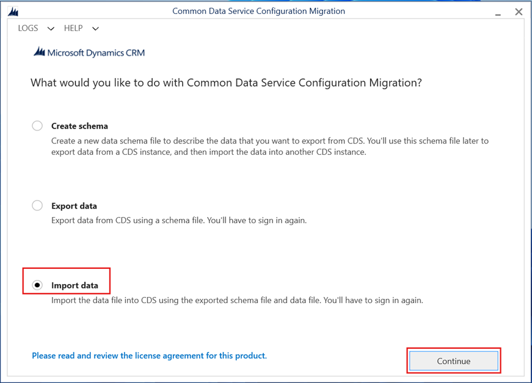

# Adding new categories to the Scope 3 - Category 15 (Investments)
This repo provides guidance on adding additional Investment categories to the Scope 3 - Category 15 (Investments). The Investments category is based on the Partnership for Carbon Accounting Financials (PCAF) methodology. It is an industry-led initiative enabling financial institutions to measure and disclose GHG emissions for loans and investments. For more details on Category 15: Investments, please refer to the [public documentation] https://learn.microsoft.com/en-us/industry/sustainability/calculate-scope3#category-15-investments 

**Note**: The solution approach mentioned below strictly applies to 'Scope 3 -Category 15 (Investments) **ONLY**. Please don't apply the below steps to other Sustainability Data Definitions.

# What is Scope 3- Category 15
Category 15 (Investments) includes scope 3 emissions associated with the reporting company's investments in the reporting year, not already included in scope 1 and scope 2. This category is applicable to investors (i.e. companies that make an investment with the objective of making a profit) and companies that provide financial services. This category also applies to investors that are not profit driven (e.g. multilateral development banks), and the same calculation methods should be used. Investments are categorized as downastream scope 3 category because providing capital or financing is a service provided by the reporting company.

To know more about this category, please refer to [Technical Guidance for calculating Scope 3 Emissions] (https://ghgprotocol.org/sites/default/files/standards/)Scope3_Calculation_Guidance_0.pdf 

# Why are we doing this?
Microsoft Sustainability Manager (MSM) does not provide an Out of the box configuration experiences in editing the SDDs (sustainability data definitions) as they are pretty much locked down for customizations. However, we have heard few customer asks on extensbility needs for select categories such as Investments. Hence, we are providing , via this document, a supportable way of extending the Scope 3-Category 15 (Investment) to add additional categories. Please be noted, that this guidance extends to Category 15 Only.

# Business Case
Out of the box, Sustainability Manager provides 7 pre-defined categories for Scope 3 -Category 15 as below. While these are useful, many organizations report their investiment activities beyond the pre-defined categories and hence have a need to be able to add new categories as per their business needs.

Business loans and unlisted equity
Commercial real estate
Listed equiity and corporate bonds
Mortgages
Motor vehicle loans
Project finance
Soverign bonds

# Business Scenario

Contoso corp is implementing Microsoft Sustainability Manager (MSM) to report Scope 1, Scope 2 and Scope 3 emissions. Their need for Scope 3 category 15 (Investments) require more listed categories beyond what is available Out of the box. To accurately represent the non-listed categories, Contoso corp wishes to have a 'Generic' category under Category 15 (investments) to report the non-listed cateogires.

# Solution outcome

By adding the 'Generic' category to the Category 15 (Investments), customer would now be able to categorize the Investment activities under 'Generic' to calculate the emissions.

Once the solution is setup, the 'Generic (Activities)' would look like below in the Sustainability Manager: 

The calculation model would reflect the new category for 'Category 15 (Investments)' as below

The view for the Activities would appear like this when clicked from 'Carbon Activities'

Finally, the out of the box dashboard (Emissions Insights) show up the generic category 

# Design Approach
To add a new category  ('Generic Activities' ) under Category 15 (Investments), we need to follow the below approach.

1. Add a new choice to PCAF asset class type global option set to represent the new activity category
2. Add two custom views under 'Investment' and 'Emissions' tables with a filter to select the new PCAF asset category created above. These views are helpful to filter the Activities and Emissions by the new PCAF category created above
3. Create two new SDD (Sustainability data definition) records in 'Sustainability Data Defintion' table to represent the Activity and Emission associated to the new PCAF category
4. Create two new records in 'Sustainability Data Definition Setting' table for Activity and Emission SDD types associated to the new PCAF category
5. Create business rule to default the 'Sustainability Data Definition' when the new PCAF category is selected from the Form
6. Migrate the above configurations to upper environments using the standard ALM practices

Note: This documentation focus mainly on the approach of realizing the business scenario. It is always recommended to follow the ALM best practices while dealing with solution components, such as creating custom unmanaged solutions in Dev environments and export as managed solutions in the upstream environments. 

## 1. Add a new choice value to PCAF asset class type

Steps for adding new option set value:
a. Open the [maker portal] (https://make.powerapps.com) and naivgate to the desired environment	
b. Open 'PCAF asset class type' global option set from the custom solution in Power Apps portal.
c. Click “+ New choice” button to add new option
d. Enter 'Generic' under Label -> Click Save -> Select PCAF asset class type and click Publish

## 2. Create custom views

New views must be created under Investment and Emission table as below.  Please note that these new views must be included in the custom solution so that they can be migrated go to other environment via solution deployment process.

### Custom Views

Add two views as per the below configuration.

| SI. No    | Table Name     | View Name   | Columns    | Filter Criteria |
|-----------------|----------------|----------------|----------------|----|
| 1 | msdyn_investment  | Investments - Generic | *<<add the columns>>*  | *PCAF asset class type Equals 'Generic'* |
| 2* | msdyn_emission | investments - Generic (Emissions)  | *<<add the columns>>* | *Emission source Equals 15. Investments - Generic (Emissions)* |

 **Important**: *Step 2 (instructions h, i, j below) can be performed after completing Section 3 below, which explains creating the new Sustainability data definition for the 'Generic' investment activity*.

**Steps for adding a new view in Investment table**

a.	Open an existing view Investments - Business loans and unlisted equity under Investment table from custom solution

b.	Click Save As button -> Give new view name as Investments - Generic -> Click OK

c.	Click on “Edit filters” button

d.	Set “PCAF asset class” Equals Generic  Click OK button

e.	Publish Investment table
f. Record the viewid of the above view as this is required to be stamped in the next step

Steps for adding new view in Emission table

f.	Open an existing view Investments - Business loans and unlisted equity (Emissions) under Emission table from default solution

g.	Click Save As button -> Give new view name as Investments - Generic (Emissions) -> Click OK

h.	Click on “Edit filters” button

i.	Set “Emission source” Equals 15. Investments – Generic (Emissions) -> Click OK button
 

j.	Publish Emission table

k. Record the viewid of the above view as this is required to be stamped in the next step

### Investment Main Form
Main form and field configurations must be applied to the Investment entity as described below. Please note that these configurations must be included in the custom solution so that they can be migrated go to other environment via solution deployment process.

**Steps for adding Sustainability Data Definition field in Investment Main Form**

a. Open an existing Investments main form.

b. Add the **Sustainability Data Definition** field to a suitable section on the form.

c. Set the visibility of the field as per your needs.

d. Save and publish the form to apply the changes.

### 3. Create Sustainability Data Definition Records to create new SDDs for 'Generic' category

Two new records with below information must be created under Sustainability data definition (msdyn_sustainabilitydatadefinition) table each for Investment Activity and Emission:

| SI. No    | Column Name |Data Type    | Record 1 value (Activity) | Record 2 value (Emission)   |
|-----------|----|-----------|-----------|-----------|
|1|Name|Text|15. Investments – Generic (Activities)|15. Investments – Generic (Emissions)|
|2|Activity type data field|Text|msdyn_pcafassetclass||
|3|Definition detail|Lookup|Investments|Investments|
|4|Description|Text|Emissions generated from operation of investments (equity, debt investment, project finance) not included in Scope 1 and Scope 2. |Emissions generated from operation of investments (equity, debt investment, project finance) not included in Scope 1 and Scope 2. |
|5|Entity logical name|Text|msdyn_investment|msdyn_emission|
|6|Is virtual|Boolean|No|No|
|7|Module|Lookup|Carbon activities|Carbon emissions|
|8|Query view Id|Text|*Paste the Activity viewID created in the previous step*| *Paste the emission viewID created in the previous step (2-k)*|
|9|Required field rules|Text|| |
|10|Source definition detail|Lookup||15. Investments - Generic|
|11|Subcategory|Lookup|15. Investments| 15. Investments|

### 4. Create Sustainability Data Definition Setting Records

Two new records with below information must be created under Sustainability data definition setting table as below.

| SI. No    | Column Name |Data Type    | Record 1 value (Activity) | Record 2 value (Emission)   |
|-----------|----|-----------|-----------|-----------|
|1|Allow As Source In Calculations|Boolean|Yes|Yes|
|2|Is Enabled for Goals|Boolean|Yes|Yes|
|3|Require Data Approval|Boolean|No|No|
|4|Sustainability Data Definition|Lookup|15. Investments - Generic|15. Investments – Generic (Emissions)|
|5|Reporting date field|Date|msdyn_consumptionenddate|msdyn_consumptionenddate|

### 5. Create Business Rule to set Sustainability Data Definition

This step is required when there is a need to manually enter the new Investment category data from UI. This Business Rule under Investment entity auto populates the 'Sustainability Data Definition' lookup field that needs to be setup when saving the form.

1. Create a new Business Rule under the custom solution
2. Business rule is defined as follows
3. The scope of the business rule should be set to **All Forms**

*If PCAF asset class = Generic  
Then, set ‘Sustainability data definition’ field value to ‘15. Investments – Generic (Activities)’*

**Note**: What is important is to ensure the 'Sustainability Data Definition' is filled out appropriately as per the tagged custom PCAF Asset Class Type. Rest is the logic as per your needs.

### 6. Migration to other environments

#### Solution packaging
The solution must include the **Sustainability Data Definition** object, since it’s used in the business rule and needed for the deployment.

#### Configuration Migration
Repeat the solution deployment steps in each environment to import the changed/new components (of table views and global option set, Business Rue). If the upstream environment is of Production type, consider importing a managed solution of the custom solution to prevent direct changes.

#### Data Migration
Use the Configuration Migration Tool (CMT) to migrate the configuration data created (step 3, 4 above).  Follow the steps below to migrate the configuration data from one environment to another:
A.	Download latest Dynamics 365 SDK and extract.

B.	Navigate and open ConfigMigration folder.

C.	Open config migration tool by double clicking “DataMigrationUtility.exe” file.

D.	Select Import data radio button -> Click Continue button

E.	Select Display list of available organizations and Show Advanced check boxes

F.	Enter the User Name and Password -> Click Login button

G.	Select the organization to which the data needs to be imported -> Click Login button

H.	Click browse button and select the .zip data file  Click Import Data button

I.	Ensure there are no errors or warnings reported, and all four records are created successfully -> Click Exit button

